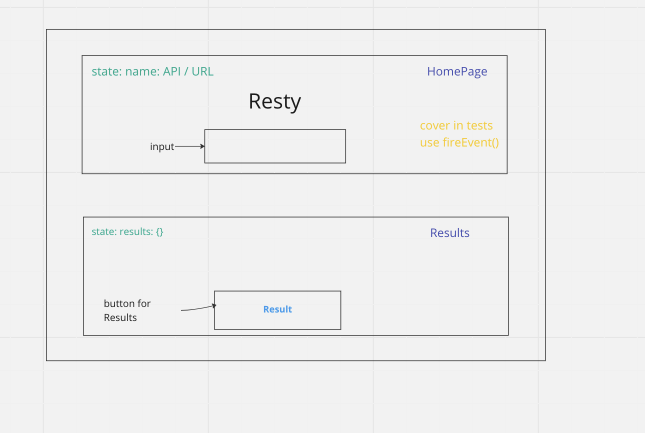

# RESTy

## LAB - Component Based UI

RESTy Phase 1: Begin work on the RESTy API testing application.

### Phase 1 Requirements

Today, we begin the first of a 4-Phase build of the RESTy application, written in React. In this first phase, our goal is to setup the basic scaffolding of the application, with intent being to add more functionality to the system as we go. This initial build sets up the file structure so that we can progressively build this application in a scalable manner.

### Phase 2 Requirements

### Phase 3 Requirements
In phase 3, we will be connecting RESTy to live APIs, fetching and displaying remote data. Our primary focus will be to service GET requests.

The following user stories detail the major functionality for this phase of the project.

As a user, I want to enter the URL to an API and issue a GET request so that I can retrieve it’s data.
As a user, I want to see the results returned from an API request in my browser in a readable format.
Application Flow:

User enters an API URL.
Chooses a REST Method.
Clicks the “Go” button.
Application fetches data from the URL given, with the method specified.
Displays the response headers and results separately.
Both headers and results should be “pretty printed” JSON.
